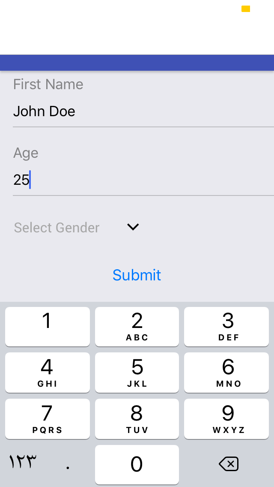

# React Native Form Runtime
Form runtime is a react container that let you to have dynamic forms based on design json schema.

# Sample output

# Prerequisites
You must have installed Expo And Native base in your application.

# Installing
```sh
$ yarn add react-native-form-runtime
```
# Simple Example
```sh
import FormRuntime from "react-native-form-runtime";
...
const formDesign = [
      {
        type: "Text",
        field: "firstName",
        label: "First Name"
      },
      {
        type: "Number",
        field: "age",
        label: "Age"
      },
      {
        type: "Picker",
        field: "gender",
        label: "Select Gender",
        options: ["Male", "Female"]
      }        
    ];
...
_submit(formData: {}, ACTION: string) {
    console.log(formData);
} 
...
 <FormRuntime
    formDesign={formDesign}
    type="submit"
    submit={this._submit.bind(this)}
    />
```
### Available Properties

| Property | Type |  Description |
| ------ | ------ | ------ |
| formDesign | Array of objects | Array holds number of fields in form 
| type | string | Action will be taken when click on submit
| submit | function | Function will be called to submit your data to server for example.

### Available Fields ( Type in form design array)

| Field |  Description |
| ------ | ------
| Text | simple text input 
| Number | simple number input 
| Checkbox | simple checkbox
| Label | text field
| Picker | picker . MUST have options property . 

# Todo

- [ ] View Mode
- [ ] Form validation
- [ ] Flow Typed And Linting
- [ ] Test
- [x] Add Picker Field
- [ ] Add more fields (Cont.)
